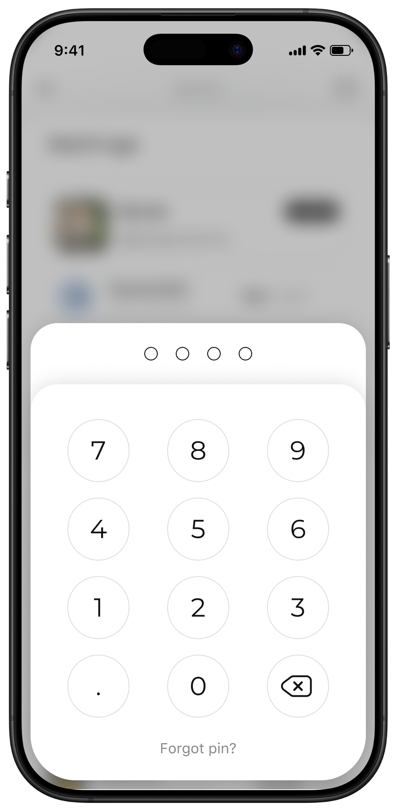

# Setting Up Your Wallet

#### Initial Setup of VAULT Wallet

Setting up your VAULT Wallet is designed to be secure yet straightforward, ensuring that you maintain full control over your digital assets. Here’s a step-by-step guide on how to create a new wallet, securely save your recovery phrase, and set up your password during the initial launch of the application:

**After creating an account, VAULT Wallet will generate Secret Recovery Phrase**: The app will automatically generate a 12-word secret recovery phrase. This phrase acts as a backup key to your wallet and can restore your wallet on any device if needed.

**Saving and Confirming the Secret Recovery Phrase**

1. **Note the Phrase**: Carefully note down the 12-word phrase. Make sure to write it in the exact order it's displayed.
2. **Secure Storage**: It is crucial to store this phrase securely. Writing it down on a piece of paper and storing it in a safe place, such as a safe deposit box or a secure home safe, is highly recommended. Avoid storing the phrase digitally to prevent potential cyber threats.
3. **Phrase Confirmation**: To ensure that you have recorded the phrase correctly, the app will ask you to re-enter the phrase. This step verifies that the phrase has been noted accurately and confirms your ability to recover the wallet if necessary.

**Setting Up a Password**

1. **Choose a Strong Password**: After confirming your recovery phrase, you will be prompted to create a password for your wallet. Choose a strong password that includes a mix of letters, numbers, and symbols to enhance security.
2. **Password Confirmation**: Enter the password again to confirm it. This step ensures that there are no errors in your password.
3. **Enable Additional Security Features**: If available, enable additional security features such as two-factor authentication (2FA) to further secure your wallet access.

**Finalizing Setup**

1. **Complete Setup**: Once you have confirmed your recovery phrase and set your password, complete the setup process by following any additional on-screen instructions.
2. **Access Your Wallet**: You can now access your wallet, start receiving and sending cryptocurrencies, and explore other features available in VAULT Wallet.

By following these steps, you can ensure that your VAULT Wallet is secure and ready to use. Remember, the security of your wallet largely depends on how safely you store your recovery phrase and how strong your password is. Always take the necessary precautions to protect your digital assets.

<figure><figcaption></figcaption></figure> <figure><figcaption></figcaption></figure>

