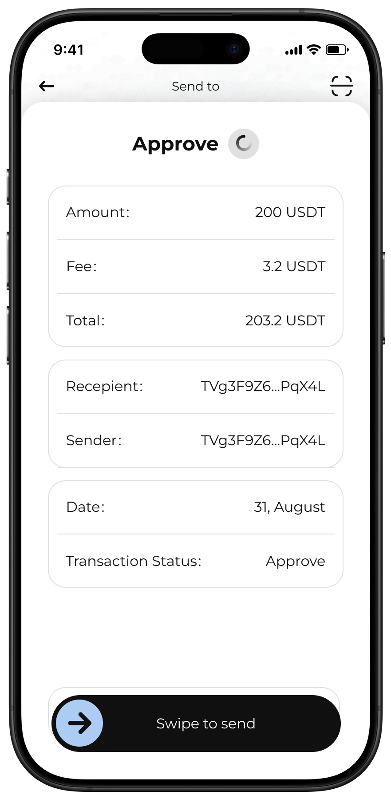

# Sending and Receiving Cryptocurrencies

The "Sending and Receiving" feature in VAULT Wallet is engineered to ensure straightforward and efficient cryptocurrency transactions. The wallet interface is designed to be intuitive, allowing users to quickly access essential functions for managing their digital assets.

**Sending Cryptocurrencies:**

1. **Access Send Function:**
   * **Send Button:** Users can easily initiate a transaction by clicking the "Send" button prominently displayed on the main screen of the wallet.
2. **Enter Transaction Details:**
   * **Recipient's Address:** Users must enter the recipient’s cryptocurrency address into the designated field. This can be typed manually or pasted from the clipboard.
   * **Amount to Send:** The amount of cryptocurrency to be sent is entered next. The wallet interface provides an additional option to select the maximum available balance with a single click, if desired.
   * **Transaction Review:** Before confirming, the interface displays a summary of the transaction for review, including the recipient's address, the amount, the transaction fees, and the total amount to be deducted from the user's wallet.
3. **Confirm Transaction:**
   * **Select Transfer Route:** After entering the transaction details, users are presented with multiple transfer routes to choose from, as suggested by the Path Finder Engine (PFE). These routes are optimized for cost, speed, and reliability, allowing users to select the most advantageous option based on their preferences.
   * **Security Check:** Users confirm the transaction details and finalize the send operation by entering a password or PIN, or by using biometric authentication if enabled. This step ensures that all transactions are secure and authorized by the wallet owner.
   * **Transaction Processing:** Once the route is selected and the security check is completed, the wallet processes the transaction, broadcasting it to the respective blockchain network.

**Receiving Cryptocurrencies:**

1. **Access Receive Function:**
   * **Receive Button:** Located on the main screen, the "Receive" button opens the interface to accept incoming funds.
2. **Display Wallet Address and QR Code:**
   * **Wallet Address:** Users can easily copy their wallet address to share with the sender or display it as a QR code for quick scanning.
   * **QR Code:** The QR code can be enlarged and shown to the sender in person or shared digitally, simplifying the process of receiving funds.
3. **Transaction Confirmation:**
   * **Incoming Funds:** The wallet automatically updates to show incoming transactions as they are processed by the blockchain network.

**Transaction History:**

* **View Past Transactions:** Both sent and received transactions are recorded in the wallet’s transaction history. Users can access this log to review detailed information about each transaction, including dates, amounts, recipients/senders, and status.
* **Search and Filter Options:** The history interface includes features to search and filter transactions, making it easier for users to find specific transactions based on date, amount, or counterparty.

**User Experience Focus:**

This functionality is crafted to be user-friendly, ensuring smooth and efficient crypto transfers. VAULT Wallet's design prioritizes accessibility and ease of use, enabling both novice and experienced users to perform transactions with confidence and minimal effort.

<figure><figcaption></figcaption></figure>
